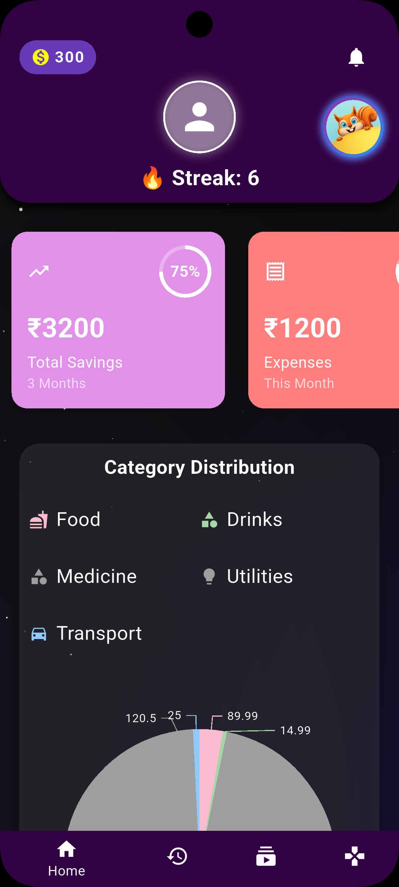
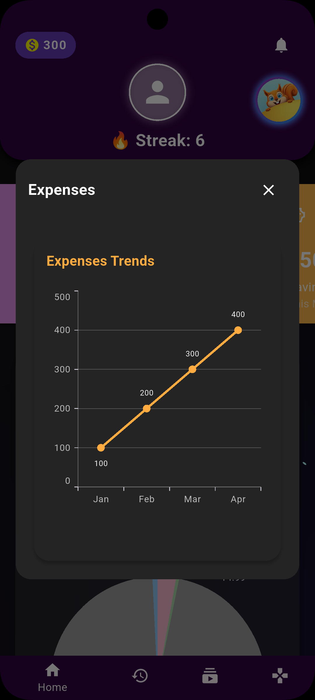
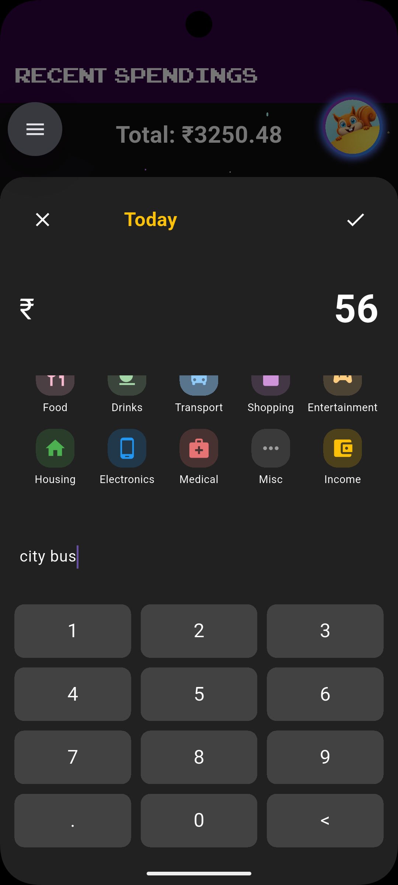
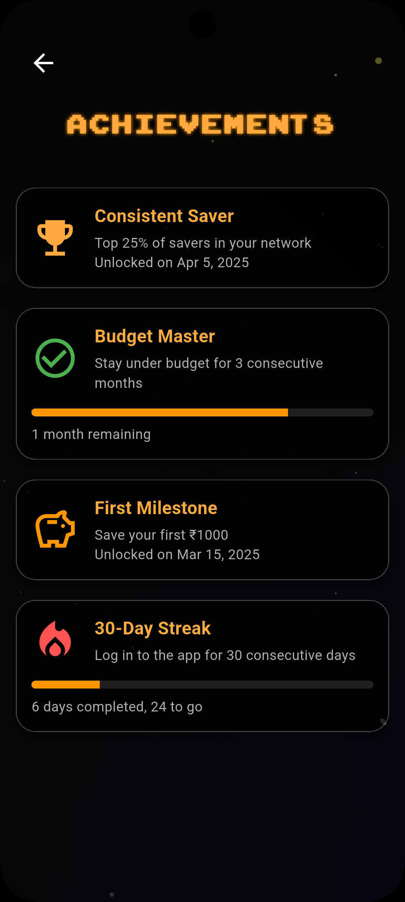
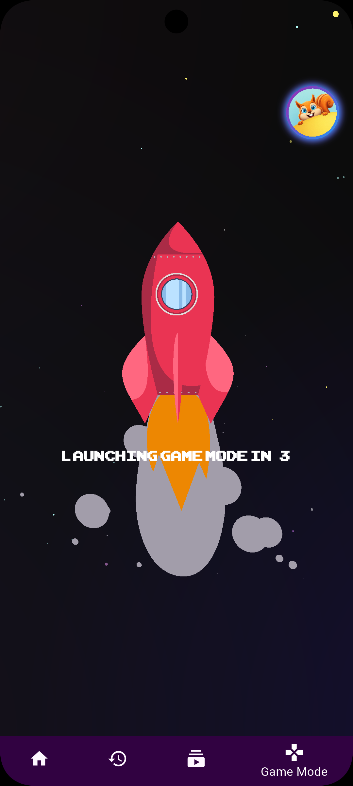
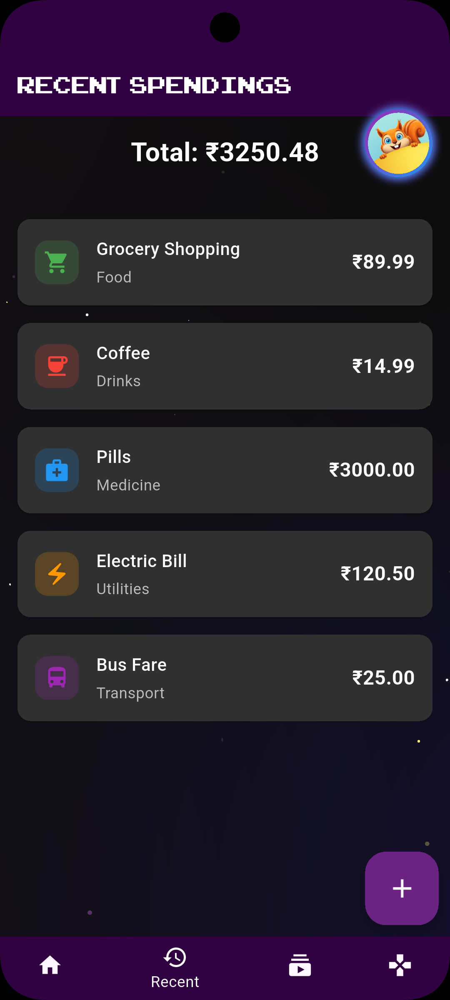
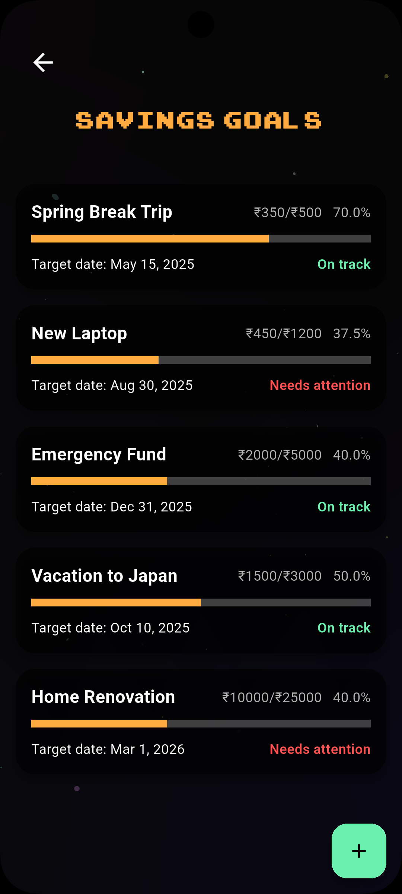
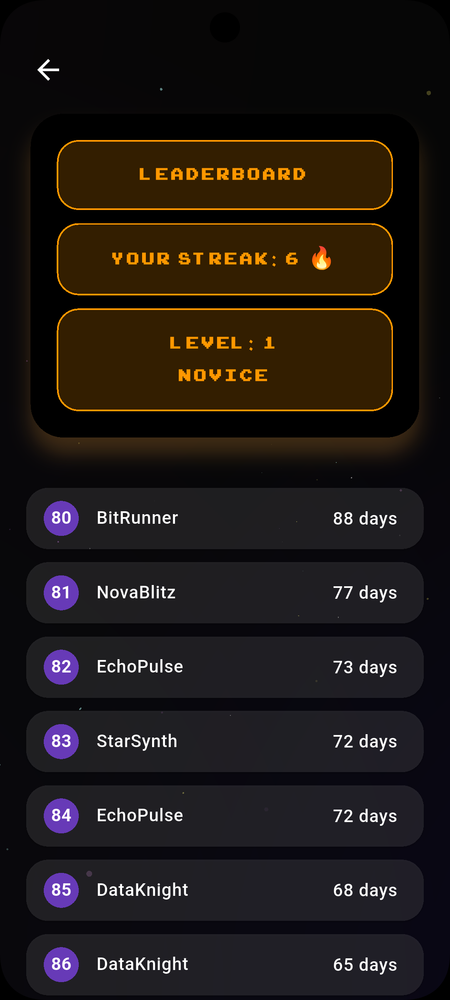
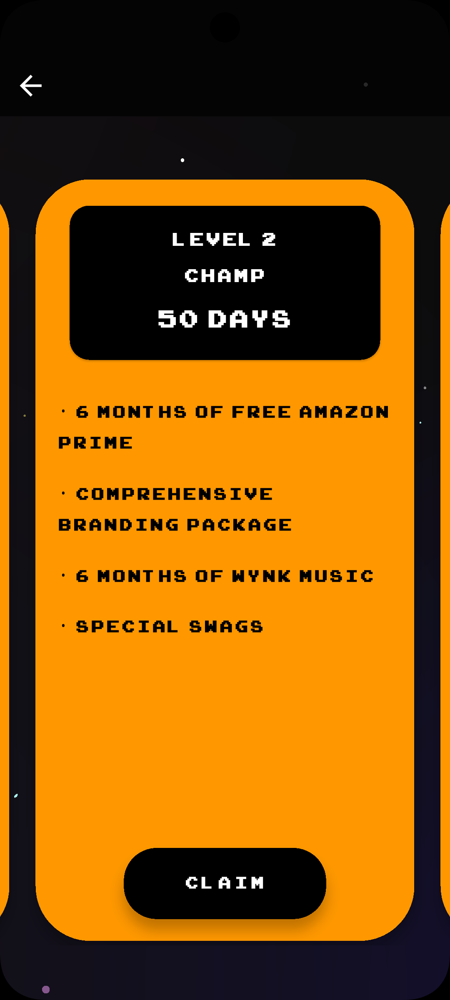

<p align="center">
  
</p>

<h1 align="center">Pocket Pal</h1>
<p align="center">A Gamified Expense Tracker that Makes Money Management Fun!</p>

## ✨ Features

- **🎮 Gamified Experience**: Track expenses while earning XP and maintaining streaks
- **📊 Visual Analytics**: Beautiful charts and graphs to visualize your spending
- **🎯 Custom Categories**: Organize expenses with colorful, intuitive categories
- **💰 Real-time Balance**: Keep track of your savings and expenses instantly
- **🏆 Rewards System**: Earn pocket coins and unlock achievements
- **📱 User-Friendly Interface**: Modern, clean design with smooth animations

## 🎯 Core Features

- Track daily expenses and income
- Visualize spending patterns with interactive graphs
- Maintain daily streaks for consistent tracking
- Earn rewards for good financial habits
- Categorize expenses with custom icons and colors
- View detailed transaction history

## 🛠️ Built With

- Flutter
- Provider State Management
- Custom Animations
- Syncfusion Charts
- Shared Preferences for Local Storage

## 🚀 Getting Started

1. Clone the repository:
```bash
git clone https://github.com/Elementx07/pocket_pal.git
```

2. Install dependencies:
```bash
flutter pub get
```

3. Run the app:
```bash
flutter run
```

## 📱 Screenshots

<p align="center">
  
  &nbsp;&nbsp;&nbsp;&nbsp;
  
  &nbsp;&nbsp;&nbsp;&nbsp;
  
</p>

<p align="center">
  
  &nbsp;&nbsp;&nbsp;&nbsp;
  
  &nbsp;&nbsp;&nbsp;&nbsp;
  
</p>

<p align="center">
  
  &nbsp;&nbsp;&nbsp;&nbsp;
  
  &nbsp;&nbsp;&nbsp;&nbsp;
  
</p>

## 🤝 Contributing

Contributions are welcome! Feel free to submit a Pull Request.

## 📄 License

This project is licensed under the MIT License - see the [LICENSE](LICENSE) file for details.
